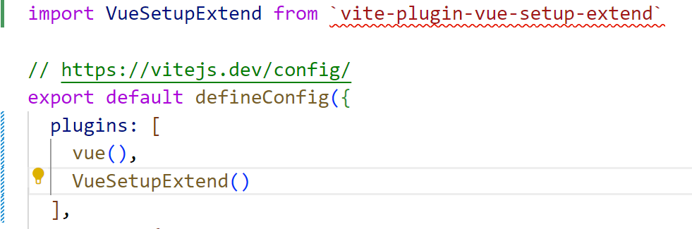

# vue3-example

记录一下在 B 站跟着尚硅谷的 vue3。

### Development Environments

开发环境/框架及版本

VS Code
Node.js ^20
Vue ^3.4

### Notes

本人笔记在此~

- [这里是 vit 的笔记](vite-note.md)
- [这里是 vue3 的笔记](vue3-note.md)
- 从 27 小节后，就有意识地将每一小节的笔记或者说明都整理到了对应小节文件中，详见 backups 文件中的代码~

### Update

#### 2024/10/14

setting->extention->Auto Insert: Dot Value 勾选后当使用 ref 后 vscode 会自动补充`.value`

#### 2024/10/13

- ` npm i vite-plugin-vue-setup-extend -D`安装插件，并添加，使得`<script lang="ts" setup name="1234">`中的 name 生效。如下：
  

#### 2024/10/10

- 编写了 Person 组件。
- 在谷歌中下载了 vue 扩展程序(尚硅谷 05)

#### 2024/10/5

1. 创建一个 vue3 项目。
2. 编写了 App 组件。
